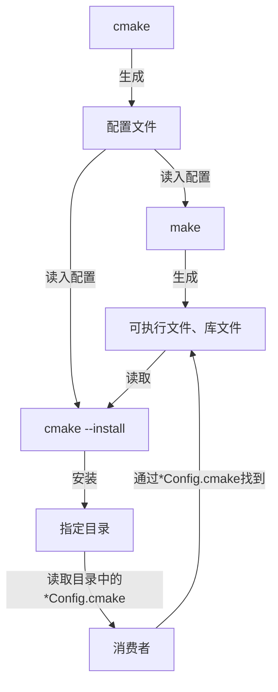

本文使用的 CMake 版本为：`3.16.3`；C/C++ 编译器为 `clang-17`。

---

在我们需要使用第三方包时，我们需要：

- 在安装时，使用 [CMAKE_INSTALL_PREFIX 标志](#cmake_install_prefix-标志) 来指定安装根目录；
- 安装完成后，可以用 [CMAKE_PREFIX_PATH 标志](#cmake_prefix_path-标志) 指定包的搜索路径。

当我们需要编写 CMake 可安装库时，我们需要：

- 用 [install() 命令](#install-命令) 配置安装流程，以及生成 `*Config.cmake` 文件供消费者（引用包的人）搜索包文件。

整体流程大概是：



## CMAKE_INSTALL_PREFIX 标志

`CMAKE_INSTALL_PREFIX` 是一个 CMake 变量，它定义了项目在执行安装（install）操作时，文件将被复制到的根目录。

### 什么时候设置和使用？

##### 在命令行中设置

通常在 CMake **配置阶段**（运行 `cmake ...` 命令时）通过命令行参数 `-DCMAKE_INSTALL_PREFIX=<路径>` 来设置。消费者可以指定他们希望软件安装到哪个目录下。 例如：

```bash
cmake -DCMAKE_INSTALL_PREFIX=/opt/myproject <path/to/CMakeLists.txt>
```

如果在配置时没有显式指定，CMake 会有一个默认值（通常是 `/usr/local` 或 `/usr`，取决于系统和 CMake 版本）。

##### CMake 自动使用

在 CMakeLists.txt 中，用 `install()` 命令来定义哪些文件和目标需要安装，以及它们相对于 `CMAKE_INSTALL_PREFIX` 应该放在哪个子目录下。

在执行 `make install` 或 `cmake --install` 命令时，CMake 会读取这些 `install()` 定义，并将相应的文件复制到 `CMAKE_INSTALL_PREFIX` 指定的路径下的正确位置。

## CMAKE_PREFIX_PATH 标志

消费者在自己的 `CMakeLists.txt` 中加入：

```cmake
list(APPEND CMAKE_PREFIX_PATH absolute/path/to/<Package>Config.cmake)
```

然后调用 `find_package(<Package> REQUIRED)` 就会在上述路径中搜索 `<Package>Config.cmake` 文件，该文件会收集包的必要信息。

## install() 命令

**`install()` 命令：**
这是在 `CMakeLists.txt` 中定义安装规则的核心命令。它告诉 CMake 需要安装哪些文件、哪些目标，以及它们相对于 `CMAKE_INSTALL_PREFIX` 应该放在哪个目录下。

常用的 `install()` 用法包括：

```cmake
# 安装 myexecutable 到 ${CMAKE_INSTALL_PREFIX}/bin
install(TARGETS myexecutable DESTINATION bin)
# 安装 mylibrary (动态或静态) 到 ${CMAKE_INSTALL_PREFIX}/lib
install(TARGETS mylibrary DESTINATION lib)

# 安装 myheader.h 到 ${CMAKE_INSTALL_PREFIX}/include
install(FILES include/myheader.h DESTINATION include)

# 安装 conf 目录下的所有内容到 ${CMAKE_INSTALL_PREFIX}/share/myproject/conf
install(DIRECTORY conf/ DESTINATION share/myproject/conf)
```

### 导出项目安装信息

我们还可以导出项目安装信息：

```cmake
install(EXPORT <export-name> DESTINATION <相对路径> ...)
```

这个用于导出 CMake 目标信息，生成 `.cmake` 文件（如 `*Config.cmake`），使得其他 CMake 项目可以通过 `find_package()` 来找到并使用该项目。

这些导出的文件通常安装在：

```cmake
${CMAKE_INSTALL_PREFIX}/lib/cmake/<ProjectName>
${CMAKE_INSTALL_PREFIX}/share/cmake/<ProjectName>
```

### 安装命令

在编译完成后，执行以下命令，会触发 CMake 的安装过程，根据 `CMakeLists.txt` 中定义的所有 `install()` 规则，将文件从构建目录复制或移动到 `CMAKE_INSTALL_PREFIX` 指定的安装目录下：

* `make install`：如果用的是 Makefile 生成器。
* `cmake --install <构建目录>`：这是更通用的方法，适用于所有 CMake 生成器。

## 应用示例

现在我们创建一个目录结构如下：

```
Apple/
├── CMakeLists.txt
├── install
├── src
│   ├── Apple.cc
│   ├── Apple.h
│   └── CMakeLists.txt
└── test
    ├── CMakeLists.txt
    └── main.cc
```

在这个项目中，我们定义了一个 `Apple` 类，这个类依赖于 `ZLIB`。

### C++ 文件

```cpp
// src/Apple.h
#include <iostream>
#include <string>
#include <vector>

class Apple {
public:
    Apple(std::string data);
    ~Apple();
    std::string data();
    std::vector<unsigned char> zippedString();

private:
    std::string data_;
};
```

```cpp
// src/Apple.cc
#include "Apple.h"

#include <zlib.h>

#include <iostream>
#include <string>
#include <vector>

Apple::Apple(std::string data) : data_(data) {
    std::cout << "Apple constructor called" << std::endl;
}

Apple::~Apple() {
    std::cout << "Apple destructor called" << std::endl;
}

std::string Apple::data() {
    return data_;
}

std::vector<unsigned char> Apple::zippedString() {
    uLong srcLen = data_.size();
    uLong destLen = compressBound(srcLen);
    std::vector<unsigned char> out;
    out.resize(destLen);

    // Compress the string
    int res = compress(out.data(), &destLen, reinterpret_cast<const Bytef *>(data_.data()), srcLen);
    if (res != Z_OK)
    {
        std::cerr << "compress() failed with code " << res << std::endl;
    }

    out.resize(destLen); // trim unused space
    return out;
}
```

```cpp
// test/main.cc
#include "Apple.h"

#include <iostream>
#include <vector>

int main() {
    Apple apple("Hello, World!");
    std::cout << "Apple data: " << apple.data() << std::endl;

    for (auto byte : apple.zippedString()) {
        std::cout << byte;
    }
    std::cout << std::endl;
}
```

### CMakeLists.txt

然后是主目录、`test` 目录、`src` 目录下的 `CMakeLists.txt`：

```cmake
# ./CMakeLists.txt
cmake_minimum_required(VERSION 3.16)
project(Apple VERSION 0.1.0)

set(CMAKE_C_COMPILER clang) # set C compiler
set(CMAKE_CXX_COMPILER clang++) # set C++ compiler
set(CMAKE_RUNTIME_OUTPUT_DIRECTORY ${CMAKE_BINARY_DIR}/bin) # set runtime output dir

add_compile_options(-stdlib=libc++) # set compile options
add_link_options(-stdlib=libc++ -lc++ -lc++abi -fuse-ld=lld) # set link options

add_subdirectory(test)
add_subdirectory(src)
```

```cmake
# test/CMakeLists.txt
add_executable(main main.cc)
target_link_libraries(main PRIVATE Apple)
```

```cmake
# src/CMakeLists.txt

# 定义一个库目标
file(GLOB LIB_SRC *.cc)
add_library(Apple SHARED ${LIB_SRC})
set(Apple_INSTALL_CMAKEDIR cmake/mylib)

# 定义库的公共包含目录（接口属性 INSTALL_INTERFACE 会被导出）
target_include_directories(Apple
    PUBLIC
        $<BUILD_INTERFACE:${CMAKE_CURRENT_SOURCE_DIR}/include>
        $<INSTALL_INTERFACE:include>
    PRIVATE
        src
)

# 定义库的接口链接依赖（例如依赖第三方库）
find_package(ZLIB REQUIRED)
target_link_libraries(Apple PUBLIC ZLIB::ZLIB)

# --- 安装实际的目标文件 ---
install(DIRECTORY include/
    DESTINATION include
    FILES_MATCHING PATTERN "*.h"
    PATTERN ".svn" EXCLUDE
)

# 安装库文件到 ${CMAKE_INSTALL_PREFIX}/lib
set(TARGETS_EXPORT_NAME AppleTargets)
install(TARGETS Apple
    DESTINATION lib
    EXPORT ${TARGETS_EXPORT_NAME}
)

# --- 生成并安装导出文件 ---
install(EXPORT ${TARGETS_EXPORT_NAME}
    DESTINATION ${Apple_INSTALL_CMAKEDIR}
    NAMESPACE mylib::
)

# 生成并安装 Package Configuration 文件
include(CMakePackageConfigHelpers)
# 生成 AppleConfig.cmake 到构建目录
configure_package_config_file(
    ${PROJECT_SOURCE_DIR}/cmake/${PROJECT_NAME}Config.cmake.in
    ${CMAKE_CURRENT_BINARY_DIR}/${PROJECT_NAME}Config.cmake
    INSTALL_DESTINATION ${Apple_INSTALL_CMAKEDIR}
)
# 生成 *ConfigVersion.cmake 到构建目录
write_basic_package_version_file(
    ${CMAKE_CURRENT_BINARY_DIR}/${PROJECT_NAME}ConfigVersion.cmake
    VERSION ${PROJECT_VERSION}
    COMPATIBILITY AnyNewerVersion
)
# 将构建目录中的 *Config.cmake 等文件安装到指定路径
install(FILES
    ${CMAKE_CURRENT_BINARY_DIR}/${PROJECT_NAME}Config.cmake
    ${CMAKE_CURRENT_BINARY_DIR}/${PROJECT_NAME}ConfigVersion.cmake
    DESTINATION ${Apple_INSTALL_CMAKEDIR}
)
```

### CMake 模板文件

此外，我们还需要为 `AppleConfig.cmake` 写一个模板文件 `AppleConfig.cmake.in`：

```cmake
@PACKAGE_INIT@

# 查找依赖
include(CMakeFindDependencyMacro) # find_dependency() 宏需要这个模块
find_dependency(ZLIB REQUIRED)

# 包含版本文件
include("${CMAKE_CURRENT_LIST_DIR}/@PROJECT_NAME@ConfigVersion.cmake")

# 包含由 install(EXPORT ...) 生成的目标文件
include("${CMAKE_CURRENT_LIST_DIR}/@TARGETS_EXPORT_NAME@.cmake")

# 标记 Package 已找到
set(@PROJECT_NAME@_FOUND TRUE)
```

接下来就可以进行构建了。

> 有几点注意事项：
>
> - 模板文件中的占位符 `@TARGETS_EXPORT_NAME@` 是我们自定义的，在 `src/CMakeLists.txt` 中创建；
> - 对于库的每一个依赖（本库只用了 ZLIB 一个依赖）需要在模板文件中用 `find_dependency()` 收集包的信息。
>
> 另外，`AppleConfig.cmake` 其实就是 `configure_package_config_file()` 将 `AppleConfig.cmake.in` 中的 `@@` 占位符全部展开后生成的。

### 构建

在 `Apple` 目录下执行（这里路径替换为你的 `install` 目录绝对路径）：

```bash
rm -rf build/
mkdir build && cd build
cmake .. -DCMAKE_INSTALL_PREFIX=/path/to/Apple/install
```

### 安装

在 `Apple/build` 目录下执行：

```bash
cmake --install .
```

安装完成后，我们应该能看到：

```
Apple/install/
├── cmake
│   └── mylib
│       ├── AppleConfig.cmake
│       ├── AppleConfigVersion.cmake
│       ├── AppleTargets.cmake
│       └── AppleTargets-noconfig.cmake
├── include
│   └── Apple.h
└── lib
    └── libApple.so
```

其中：

- `Apple.h` 暴露类声明给消费者，用于编译；
- `libApple.so` 为类的实际实现，用于链接；
- `cmake` 目录下是用于搜索包的 CMake 脚本。

### 消费者怎么使用 Apple 库

我们创建一个 `Peach` 目录，并写入以下文件：

```
Peach/
├── CMakeLists.txt
└── test
    ├── CMakeLists.txt
    └── main.cc
```

其中 `main.cc` 和 Apple 中的 `main.cc` 完全一样。

主目录、`test` 目录下的 `CMakeLists.txt`：

```cmake
# ./CMakeLists.txt
cmake_minimum_required(VERSION 3.16)
project(Peach VERSION 0.1.0)

set(CMAKE_C_COMPILER clang) # set C compiler
set(CMAKE_CXX_COMPILER clang++) # set C++ compiler
set(CMAKE_RUNTIME_OUTPUT_DIRECTORY ${CMAKE_BINARY_DIR}/bin) # set runtime output dir

add_compile_options(-stdlib=libc++) # set compile options
add_link_options(-stdlib=libc++ -lc++ -lc++abi -fuse-ld=lld) # set link options

list(APPEND CMAKE_PREFIX_PATH "~/Apple/install/cmake/mylib")
find_package(Apple REQUIRED)

add_subdirectory(test)
```

```cmake
# test/CMakeLists.txt
add_executable(main main.cc)
target_link_libraries(main PRIVATE mylib::Apple)
```

OK，现在我们创建并进入 `Peach/build` 目录然后执行：

```bash
cmake ..
make # 成功输出可执行文件 main
```

### 总结

至此，我们已经实现了 Apple 的安装：

- 创建一个名为 Apple 的库（`add_library()`）；
- 利用 `install(...)` 将头文件目录、库文件安装（其实就是复制）到自定义目录下（`Apple/install`）；
- 通过 `target_include_directories($<INSTALL_INTERFACE:include>)` 导出头文件目录的相对路径（相对于 `CMAKE_INSTALL_PREFIX`）到 `*Targets.cmake`；
- 利用 `install(EXPORT ...)` 导出 `*Targets.cmake` 到 CMake 的安装路径，并设置命名空间为 `mylib::`；
- 利用 CMake 宏生成 `*Config.cmake`、`*ConfigVersion.cmake` 等收集包信息并验证包可用性的 CMake 脚本；

以及消费者的使用：

- 安装完成后，消费者通过 `find_package()` 引入 Apple 库；
- 并通过 `target_link_libraries()` 将 `mylib::Apple` 链接到可执行文件。

---

你可以动手尝试一下（这个仓库里有更详细的 CMake 注释）：[如何创建一个可安装 CMake 包](https://github.com/Kymdon13/How-To-Create-Installable-CMake-Project)。
