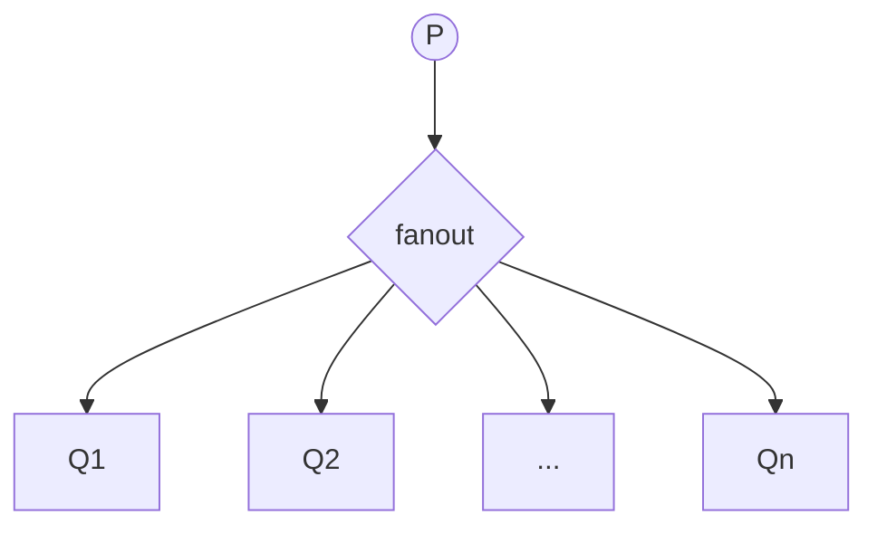
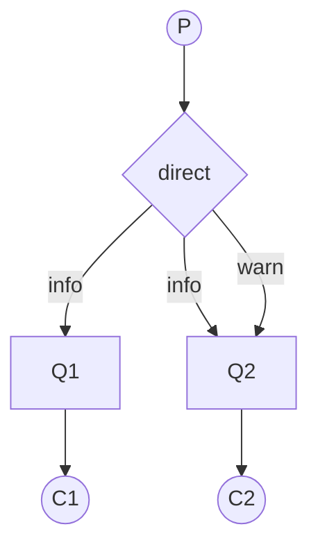
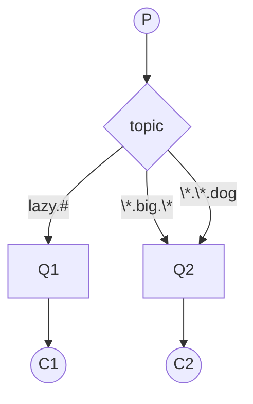
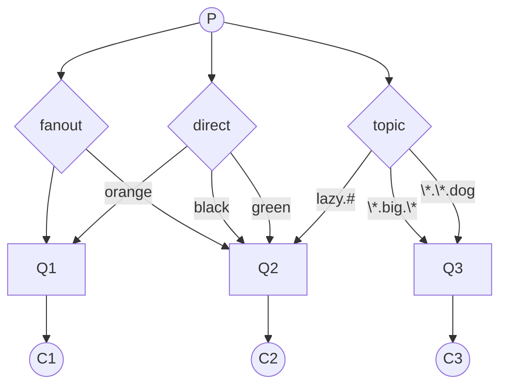
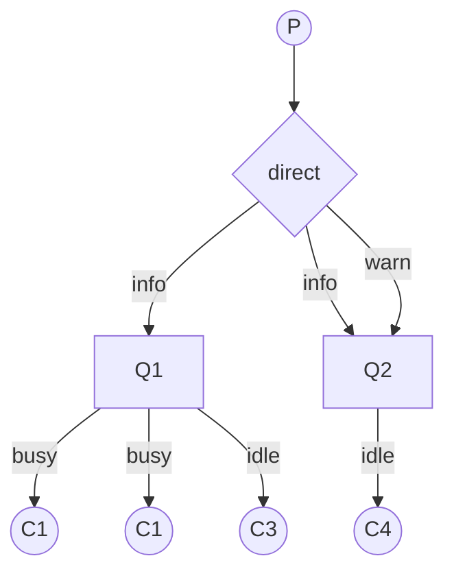

RabbitMQ 有几种常用的交换机类型：

- fanout 交换机（广播）
- direct 交换机（单播）
- topic 交换机（多播）

下面我们用几张流程图展示这几种类型。

### fanout 交换机（广播）

fanout 模式的交换机：将消息复制成 n 份（n 为队列数量），然后分发给所有队列。

### direct 交换机（单播）

direct 模式的交换机：发布消息时根据 `routing_key` 转发给对应的队列。

这里如果 `P` 发送一个 `routing_key=info` 的消息：

- direct 交换机会把消息复制为 2 份发给 `Q1`、`Q2`。

如果 `P` 发送一个 `routing_key=warn` 的消息：

- direct 交换机只会发给 `Q2`。

如果 `P` 发送一个 `routing_key=error` 的消息：

- direct 交换机没找到匹配的队列，丢弃该消息。

> 注意一个队列只能绑定一个同名的 `routing_key`，例如假设 `Q1` 绑定了两次 `info`，第二次绑定是无效的。也就是说，复制操作只发生在队列之间，不会对同一个队列复制消息

### topic 交换机（多播）

topic 模式的交换机：在 direct 模式的 `routing_key` 中加入了通配符，会复制并转发给匹配的所有队列。

其中，`*` 匹配 1 个单词，`#` 匹配 0 个或多个单词，`.` 用于分隔不同单词。

如果 `P` 发送 `lazy` 或 `lazy.`：

- 只有 `Q1` 会收到消息。

如果 `P` 发送 `lazy.big.cat`：

- `Q1` 和 `Q2` 都会收到消息。

如果 `P` 发送 `normal.big.dog`：

- 只有 `Q2` 会收到，而且只会收到一次。

### 混合模式

你可以混合上述 3 种模式形成自定义的消息转发网络。

### 负载均衡

负载均衡一般发生在消费者端：

上图中，队列 `Q1` 有 3 个消费者分摊任务负载。